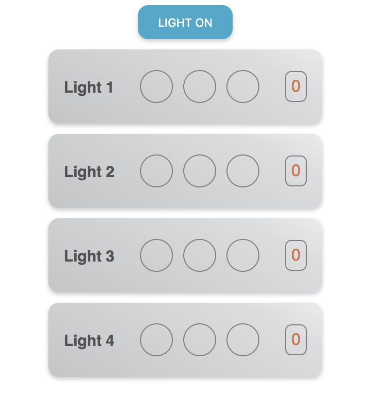
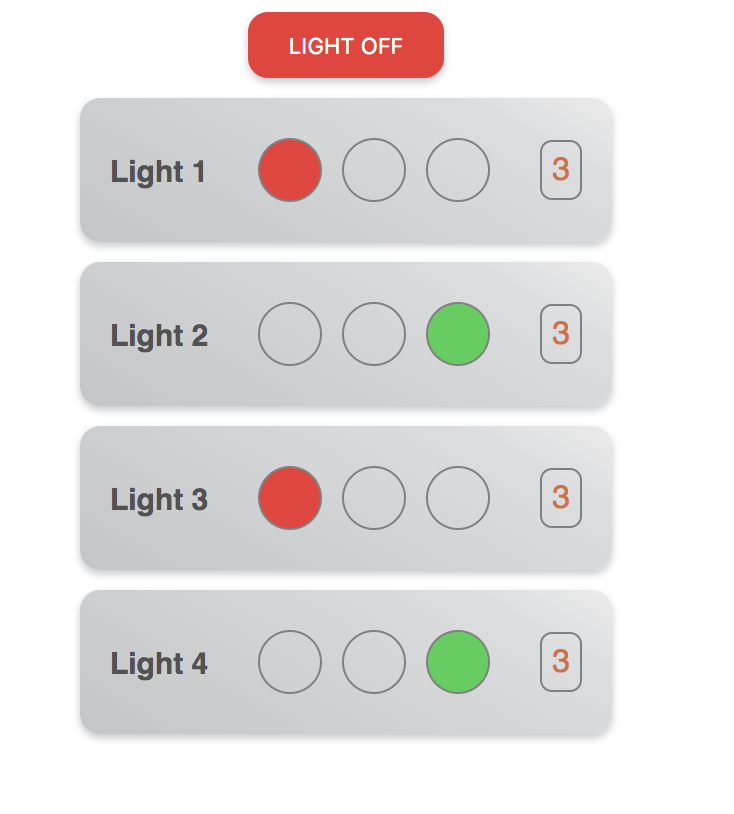
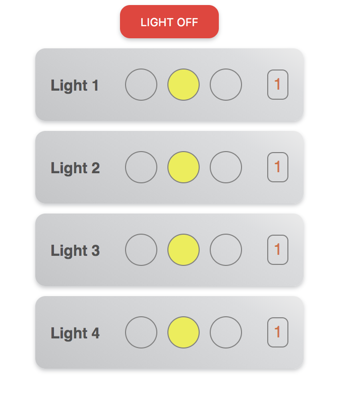
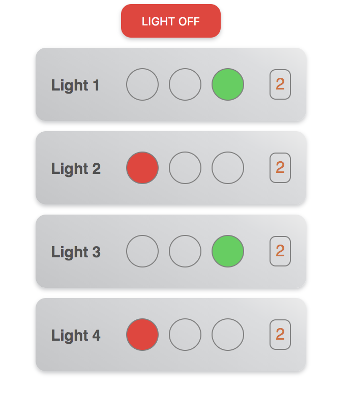

# TRAFFIC LIGHT CONTROL

### EZEDOX TASK2

## PICTURES


 1 | 2 
:---: | :---:
 |  
 **3** | **4**
 |  


## DEMO

[CodeSandbox - Traffic Light Control](https://codesandbox.io/s/mol07kw43x)

## WORK IT IN LOCAL ...

Download the project zip file and extract and go to this path ezedox-task2 and open terminal and type following commands

*1. To install dependencies* `npm install` *or* `npm i`

*2. To run the project* `npm start`

Enjoy the Project!!!


## WHAT YOU CAN DO ...

You could add any number of light boards by modifying the below line in `App.js` file from `src` folder.

```javascript
const LIGHT_COUNT = 4;
```

You could change the timing & color of the lights & total lights count which are in `TrafficLight.js` file from `src` folder.
And consider the timing values are in ***seconds***, which have been used in below lines.

```javascript
const TOTAL_LAMPS = 7; // number of lamps
const TIMING_ARRAY = [4, 3, 2, 1, 2, 3, 4]; // timing for each lamps - unit of time is seconds
const COLORS_ARRAY = [
  "red",
  "yellow",
  "green",
  "blue",
  "orange",
  "magenta",
  "indigo"
]; // color for each lamps
```
